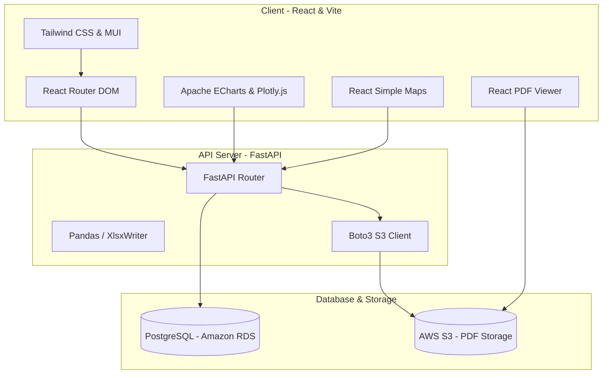

# 🔍 지자체 자체감사 결과분석 시스템 (Gamsa)

> **2024년 대한민국 지방자치단체의 자체감사 결과 데이터를 체계적으로 수집, 분석, 통계화하여 감사 행정의 투명성과 효율성을 극대화하기 위한 감사 결과 대시보드 및 분석 플랫폼입니다.**

---

## 📌 프로젝트 소개

이 프로젝트는 전국 지방자치단체와 공공기관의 산재된 자체감사 결과를 수집 및 분류하고, **AI 기술 기반의 텍스트 요약 및 키워드 추출 기술**을 접목하여 감사 결과를 한눈에 파악할 수 있도록 돕는 시스템입니다. 

사용자는 지도를 기반으로 권역별 감사 추이를 직관적으로 확인하고, 다양한 다차원 필터를 이용해 세부 감사 목록을 조회할 수 있습니다. 또한, 개별 감사보고서에 대한 AI의 분석 요약 결과와 함께 클라우드 스토리지(S3)에 안전하게 저장된 원본 PDF 파일을 내장형 뷰어로 즉시 열람 및 검토할 수 있으며, 필터링된 검색 결과를 실시간으로 엑셀 파일로 추출하는 비즈니스 지향적 기능을 제공합니다.

---

## 🛠 아키텍처 및 기술 스택

### 시스템 구성도


### 기술 스택 (Tech Stack)

#### **Frontend**
*   **Core**: React 18, Vite 7
*   **Styling**: Tailwind CSS v3, Material UI (MUI) v7, Emotion
*   **State / Routing**: React Router DOM v7
*   **Data Visualization**: Apache ECharts, Plotly.js, React Simple Maps, SVG Maps
*   **Document Viewer**: React PDF Viewer (PDF.js), SheetJS (xlsx), File-saver

#### **Backend**
*   **Framework**: FastAPI (Python), Uvicorn
*   **Database ORM**: SQLAlchemy, Alembic (Database Migration Tool)
*   **Data Processing**: Pandas, NumPy, XlsxWriter (Excel export engine)
*   **Cloud System**: AWS Boto3 (Amazon S3 integration)
*   **Validation**: Pydantic v2, Pydantic Settings

#### **Database & Infrastructure**
*   **Database**: PostgreSQL (Amazon RDS)
*   **Object Storage**: AWS S3 (감사 보고서 원본 PDF 파일 저장소)

---

## ✨ 핵심 기능 (Key Features)

### 1. 자체감사 현황 메타데이터 대시보드
*   감사실시기관, 감사대상기관, 감사사항 수, 전체 자체감사결과 건수 등 핵심 누적 통계 데이터를 홈 화면에서 한눈에 파악할 수 있는 요약 카드 제공.

### 2. 지도 기반 권역별 감사 통계 시각화
*   대한민국 지도를 활용한 인터랙티브 그래픽 제공. 지자체 영역 호버 및 클릭 시 해당 권역의 감사 경향 분석 가능.
*   권역별 감사 유형 TOP 10 통계 테이블 및 Apache ECharts, Plotly.js 기반의 다차원 드릴다운 차트(카테고리/분야/업무별) 제공.

### 3. 조건별 상세 검색 및 엑셀 내보내기
*   권역, 실시기관, 감사종류, 분야, 업무, 날짜 범위 지정 필터 지원.
*   다중 키워드 매칭(AND/OR 모드 지원) 및 특이사례 여부 필터링 등 고도화된 검색 조건 제공.
*   MUI Data Grid 기반의 데이터 그리드로 대용량의 결과 목록을 그리드 뷰로 표시.
*   사용자가 필터링한 결과 그대로 백엔드 연동을 통해 본문 전문 및 키워드를 포함한 엑셀 파일(`.xlsx`) 다운로드 기능 지원.

### 4. AI 분석 뷰어 & 내장 PDF 리더
*   감사 목록에서 항목 클릭 시 우측의 상세 패널 활성화.
*   감사 사례별 주요 조치사항, AI 자동 분야 분류, 핵심 요약문, 핵심 키워드 정보 제공.
*   AWS S3 보안 강화를 위한 **Presigned URL**을 동적 발급받아 프론트엔드의 내장 PDF 리더기를 통해 원본 PDF 파일을 즉시 조회할 수 있는 뷰어 기능 탑재.

---

## 📂 프로젝트 폴더 구조

```text
Gamsa/
├── Front/
│   └── FE/                  # React + Vite 프론트엔드 코드
│       ├── src/
│       │   ├── component/   # 대시보드, 지도, 필터, 차트, PDF 뷰어 등 컴포넌트
│       │   ├── data/        # 정적 매핑 및 코드성 데이터
│       │   ├── App.jsx
│       │   └── main.jsx
│       ├── package.json
│       └── vite.config.js
│
├── domain/                  # FastAPI 라우터 및 도메인 비즈니스 로직
│   ├── map/                 # 지도 통계 조회 API
│   ├── metadata/            # 홈 메타데이터 통계 API
│   ├── pdf/                 # S3 Presigned URL 발급 API
│   └── viewer/              # 감사 데이터 필터링 및 엑셀 다운로드 API
│
├── crud/                    # SQLAlchemy 기반 데이터베이스 CRUD 쿼리 레이어
├── utils/                   # S3 연동 및 보안 헬퍼 함수
├── alembic/                 # 데이터베이스 마이그레이션 히스토리
├── database.py              # 데이터베이스 커넥션 풀 정의
├── config.py                # Pydantic 기반 환경변수 로더
├── models.py                # SQLAlchemy DB 테이블 매핑 모델
├── schemas.py               # Pydantic API 입출력 스키마
├── main.py                  # FastAPI 엔트리포인트
├── requirements.txt         # 백엔드 의존성 패키지 목록
└── README.md                # 본 문서
```

---

## 🚀 실행 및 설치 가이드 (How to Run)

### Prerequisites
*   Python 3.10+
*   Node.js 18+ & npm (or yarn)
*   PostgreSQL Database
*   AWS S3 Bucket (감사 원본 PDF 보관용)

---

### 1. Backend Setup

#### 1) 가상환경 생성 및 활성화
```bash
# 가상환경 생성
python -m venv venv

# 가상환경 활성화 (macOS / Linux)
source venv/bin/activate

# 가상환경 활성화 (Windows)
# venv\Scripts\activate
```

#### 2) 의존성 라이브러리 설치
`requirements.txt` 파일의 인코딩에 유의하여 패키지를 설치합니다.
```bash
pip install -r requirements.txt
```

#### 3) 환경 변수 설정
루트 디렉터리에 `.env` 파일을 생성하고 AWS S3 인증 정보 및 기타 관련 설정을 작성합니다. (데이터베이스 URL은 `config.py` 설정을 참고하거나 `.env` 파일에 맞게 오버라이딩 처리합니다.)
```env
AWS_ACCESS_KEY_ID=your_aws_access_key
AWS_SECRET_ACCESS_KEY=your_aws_secret_key
AWS_DEFAULT_REGION=ap-northeast-2
S3_BUCKET_NAME=your_s3_bucket_name
```

#### 4) 데이터베이스 마이그레이션 (Alembic)
설정된 데이터베이스에 마이그레이션 히스토리를 적용합니다.
```bash
alembic upgrade head
```

#### 5) FastAPI 백엔드 실행
```bash
python main.py
# 또는 uvicorn 실행기 사용
# uvicorn main:app --host 0.0.0.0 --port 8000 --reload
```
*   서버는 기본적으로 `http://localhost:8000` 에서 구동됩니다.
*   API 명세서는 `http://localhost:8000/docs` 에서 Swagger UI를 통해 확인 가능합니다.

---

### 2. Frontend Setup

#### 1) 프론트엔드 디렉터리로 이동
```bash
cd Front/FE
```

#### 2) 패키지 설치
```bash
npm install
# 또는 yarn 사용 시
# yarn install
```

#### 3) 환경 변수 설정
`Front/FE` 경로 아래에 `.env` 또는 `.env.local` 파일을 생성하여 API 서버 주소를 설정합니다.
```env
VITE_API_BASE_URL=http://localhost:8000
```
*(참고: 설정하지 않을 경우 `vite.config.js` 에 설정된 프록시 규칙에 의해 자동으로 로컬 호스트의 백엔드로 프록시 처리됩니다.)*

#### 4) 프론트엔드 개발 서버 구동
```bash
npm run dev
# 또는
# yarn dev
```
*   브라우저에서 `http://localhost:5173` 으로 접속하여 대시보드 시스템을 확인할 수 있습니다.

#### 5) 배포용 빌드 생성
```bash
npm run build
```
*   빌드 결과물은 `Front/FE/dist` 디렉터리에 생성됩니다.
